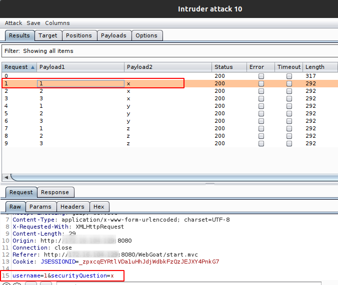

# Tipos de ataques para intruder

## Definiciones
+ **payload - carga útil:** Lista de elementos (a,b,c,1,2,3)
+ **target - position:** Lugar en que se hará la modificación. Pueden ser uno o varios. (Se representa entre "§")

******************************************************************

## Sniper (Francotirador)
Hace uso de un solo payload que iterará entre cada position. 1 a la vez.

### Ejemplo


Dos positions `username=§admin§&securityQuestion=§red§`


Este hará 12 requests en total.
+ 6 elementos en dos posiciones diferentes
+ Requests = (noElementos * noPosiciones)


Como se puede observar el ataque iterará de la siguiente forma:
+ Payload_list = [a,b,c,1,2,3]
```
1	a	parametro_original
2 	b	parametro_original
3 	c  	parametro_original
4 	1  	parametro_original
5 	2  	parametro_original
6 	3  	parametro_original

7 	parametro_original	 a
8 	parametro_original	 b
9 	parametro_original	 c
10 	parametro_original	 1
11 	parametro_original	 2
12 	parametro_original	 3
```


******************************************************************

## Battering ram (Ariete)
Hace uso de un solo payload que iterará en ambas posiciones. Todos a la vez.

### Ejemplo


Dos positions `username=§admin§&securityQuestion=§red§`


Este hará 6 requests en total.
+ 6 elementos en ambas posiciones
+ Requests = noElementos


Como se puede observar el ataque iterará de la siguiente forma:
+ Payload_list = [a,b,c,1,2,3]
```
1	a	a
2 	b	b
3 	c  	c
4 	1  	1
5 	2  	2
6 	3  	3
```


******************************************************************

## Pitchfork (Horca)
Hace uso de multiples payloads que asignarán por pares.

### Ejemplo


Dos positions `username=§admin§&securityQuestion=§red§`


**Note que es para el payload 1**

**Note que es para el payload 2**

** Las listas solamente se iterarán mientras existan elementos en ambas partes. Es decir, si una lista tiene 6 elementos y la otra 5 elementos, solamente se harán 5 iteraciones, dejando afuera al sexto valor.

Este hará 6 requests en total.
+ 6 elementos de cada lista de payload
+ Requests = noMenorDeElementos


Como se puede observar el ataque iterará de la siguiente forma:
+ Payload_list_1 = [a,b,c,1,2,3]
+ Payload_list_2 = [x,y,z,9,8,7]
```
1	a	x
2 	b	y
3 	c  	z
4 	1  	9
5 	2  	8
6 	3  	7
```

******************************************************************

## Cluster bomb 
Hace uso de multiples payloads y hace todas las combinaciones posibles

### Ejemplo


Dos positions `username=§admin§&securityQuestion=§red§`


**Note que es para el payload 1**

**Note que es para el payload 2**

Este hará 9 requests en total.
+ 3 elementos de cada lista de payload
+ Requests = (n * m)



Como se puede observar el ataque iterará de la siguiente forma:
+ Payload_list_1 = [1,2,3]
+ Payload_list_2 = [x,y,z]
```
1	1	x
2 	2	x
3 	3  	x
4 	1  	y
5 	2  	y
6 	3  	y
7 	1  	z
8 	2  	z
9 	3  	z
```

******************************************************************