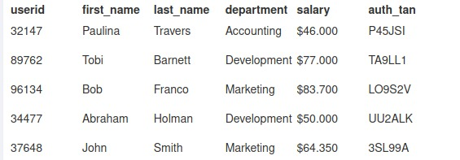
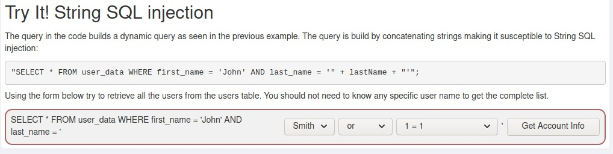
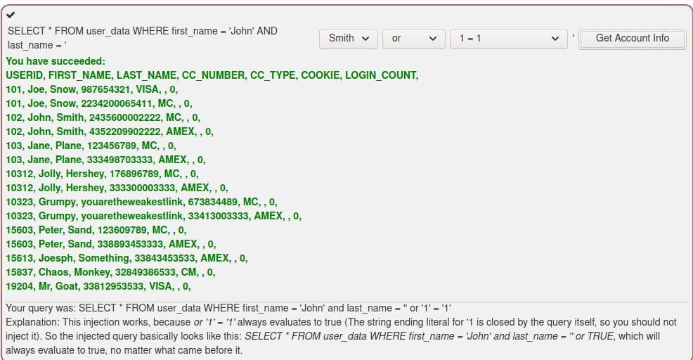

# A1 Injection

La sección A1 de webgoat se refiere a las inyecciones SQL que son utilizadas para hacer que la aplicación se comporte de una manera no prevista por el desarrollador.

##### URL para ingresar a webgoat
+ http://localhost:8080/WebGoat/

# SQL Injection (Intro)

## Ejercicio 1 (2)

El ejercicio número uno nos explica qué es una base de datos y nos recuerda que los tres principales pilares de la seguridad de la información son:
+ Confidencialidad
+ Integridad
+ Disponibilidad

También, nos muestra una Base de Datos ejemplo y nos pide que obtengamos el departamento al que pertenece el empleado Bob Franco.



#### Obten el departamento al que pertenece el empleado Bob Franco.* (Si usamos comillas dobles dentro de esta consulta fallará)

```sql
SELECT department FROM Employees WHERE first_name = 'Bob';
```

## Ejercicio 2 (3)

En el ejercicio número dos nos muestran el `DML` el *Lenguaje de Manipulación de Datos (Data Manipulation Language)* y se nos pide que cambiemos el departamento de Tobi Barnett a 'Sales'. 

**Comandos presentados:**
+ SELECT - Selecciona datos dentro de la tabla
+ INSERT - Inserta datos dentro de la tabla
+ UPDATE - Actualiza datos dentro de la tabla
+ DELETE - Borra datos dentro de la tabla

**Ejemplo:**
``` sql
SELECT phone
FROM employees
WHERE userid = 96134;
```
* Regresa el número de teléfono del empleado con user id 96134.

#### Cambia el departamento de Tobi Barnett a 'Sales'.

```sql
UPDATE Employees SET department = 'Sales' WHERE first_name = 'Tobi ';
```

## Ejercicio 3 (4)

En el ejercicio 3 nos muestran el *Data Definition Language (DDL) (Lenguaje de Definición de datos)*. El cual incluye comandos para definir la estructura de los datos.

**Comandos presentados:**
+ CREATE - Para crear bases de datos y estructuras de objetos (table, views, users)
+ ALTER - Para modificar la estructura existente en la Base de Datos
+ DROP - Para borrar objetos dentro de la Base de Datos

**Ejemplo:**
```sql
CREATE TABLE employees(
    userid varchar(6) not null primary key,
    first_name varchar(20),
    last_name varchar(20),
    department varchar(20),
    salary varchar(10),
    auth_tan varchar(6)
);
```
* Este comando crea la tabla que usamos como ejemplo en el ejercicio 1

#### Modifica el esquema para añadir la columna "phone" (varchar(20)) para la tabla "employees"

```sql
ALTER TABLE employees ADD COLUMN phone varchar(20);
```
## Ejercicio 4 (5)
*Data Control Language (DCL) (Lenguaje de Control de Datos)* es utilizado para crear privilegios para que los usuarios manipulen la Base de Datos. 

**Comandos presentados:**
+ GRANT - Otorga privilegios a los usuarios
+ REVOKE - Revoca privilegios a los usuarios

**Ejempls:**
```sql
GRANT CREATE TABLE
TO operator;
```

#### Otorga permisos al grupo de usuarios "UnauthorizedUser" para modificar las tablas
```sql
GRANT ALTER TABLE TO UnauthorizedUser;
```

## Ejercicio 5 (9) -  String SQL injection
Para este ejercicio ya entenmos cómo es que los datos son interpretados una vez que pasamos por los *inputs*. Por lo cual, nos aparece la siguiente pantalla.



La consulta que sabemos que nuestra aplicación vulnerable hará es la siguiente:
```sql
"SELECT * FROM user_data WHERE first_name = 'John' AND last_name = '" + lastName + "'";
```

Por lo que para cambiar la petición unamente tenemos que:
1. Cerrar el string que se tomará de la variable `lastName` con un `'` 
2. Hacer nuestra consulta
3. Abrir con un `'` la consulta que anteriormente cerramos

Las opciones correctas para realizar este ejercicio entonces serían:
1. `'` Para cerrar
2. `OR` Para que no importe el resultado de la otra consulta. (álgebra de boole)
3. `'1' = '1` Sin cerrar para que se autocomplete con la comilla `'` propia de la consulta original

Resultado:



## Ejercicio 6 (10) - Numeric SQL injection

En es ejercicio se cuenta con la siguiente consulta que concatena un número dando por resultado la posibilidad de crear un SQL Injection.

```sql
"SELECT * FROM user_data WHERE login_count = " + Login_Count + " AND userid = "  + User_ID;
```
* Si analizamos la sentencia no importa lo que se ingrese en el campo `Login_Count` porque está acompañado por una sentencia `AND`
* En cambio en el campo `User_ID` podemos insertar un valor seguido de un `OR` que nos permitirá valuar una expresión como verdadera

#### Obten toda la información mediante un ataque de SQL Injection. Solamente uno de los campos es susceptible a este ataque.

Los campos en los que podemos ingresar datos son:
+ `Login_Count` donde ingresaremos cualquier número, en este caso
	+ `1`
+ `User_ID` donde ingresaremos un número y añadiremos una condición OR seguida de una consulta que se evalue como true
	+ `1 OR '1' = '1'`

## Ejercicio 7 (11) - Compromising confidentiality with String SQL injection

Para este ejercicio nos plantean un ejercicio en que hemos descubierto que el sistema de nuestra empresa utiliza una sentencia similar a esta para consultar los datos del empleado.

```sql
"SELECT * FROM employees WHERE last_name = '" + name + "' AND auth_tan = '" + auth_tan + "';
```
* Si analizamos la sentencia no importa lo que se ingrese en el campo `name` porque está acompañado por una sentencia `AND`
* En cambio en el campo `auth_tan` podemos insertar un valor seguido de un `OR` que nos permitirá valuar una expresión como verdadera. Sin embargo, es importante dejar una condición abierta para que se cierre automaticamente con la comilla final `'` propia de la sentencia.

Los campos en los que podemos ingresar datos son:
+ `name` donde ingresaremos una cadena, para este caso
	+ `Persona`
+ `auth_tan` donde ingresaremos un número y añadiremos una condición OR seguida de una consulta que se evalue como true. Es importante cerrar la primer `'` destinada a cerrar la condición de auth_tan, añadir nuestra condición y posteriormente dejar abierta nuestra condición para que se cierre con la sentencia de la aplicación.
	+ `1' OR '1' = '1`

## Ejercicio 8 (12) - Compromising Integrity with Query chaining

En este ejercicio le damos continuidad al ejercicio 7 (11) que nos pedía averiguar los salarios de nuestros compañeros. Para este ejercicio decidimos aumentarnos el sueldo. Para ganar más que nuestros compañeros. 

Nuestros datos: 
+ Nombre: `John Smith` 
+ Tu TAN is `3SL99A`.

Usando la misma lógica del ejercicio número 7 (11) ingresamos de la siguiente manera los datos:

+ `name` donde ingresaremos una cadena, para este caso: `Persona`
+ `auth_tan` donde ingresaremos un número y añadiremos una condición OR seguida de una consulta que se evalue como true. Es importante cerrar la primer `'` destinada a cerrar la condición de auth_tan, añadir nuestra condición y posteriormente dejar abierta nuestra condición para que se cierre con la sentencia de la aplicación. Para este caso 
	+ `1'; UPDATE Employees SET SALARY = 9000000 WHERE FIRST_NAME = 'John`
+ Otra posible solución sería:
	+ `123'; UPDATE employees SET salary = 100000 WHERE auth_tan = '3SL99A`

## Ejercicio 9 (13) - Compromising Availability

En relación con los ejercicios 7 y 8, se nos pide eliminar la evidencia de nuestros cambios almacenada en la tabla logs. Para esto nos muestran un input que corresponde a una tabla de búsqueda. Sin embargo, a diferencia de los ejemplos anteriores, esta vez no podemos ver lo que devuelve la consulta. Se puede decir que vamos *a ciegas*.

#### Elimina la tabla access_log

Podemos imaginar que por dentro se hace una consulta muy similar a:

```sql
SELECT * FROM tabla_de_datos WHERE dato = 'parametro_input';
```

Por lo que podemos tratar de escapar la cadena y posteriormente añadir una sentencia para vaciar la tabla. Algo parecido a:

```sql
';DROP TABLE access_log;--
```
* Aquí utilizamos `--` para comentar todo lo que esté después de nuestra sentencia.


# SQL Injection (Advanced)


# SQL Injection (Mitigation)

