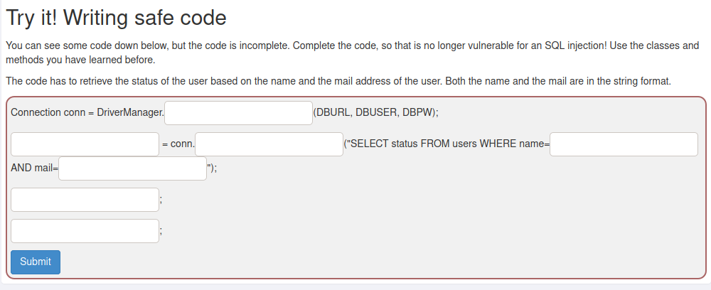

# A1 Injection

La sección A1 de webgoat se refiere a las inyecciones SQL que son utilizadas para hacer que la aplicación se comporte de una manera no prevista por el desarrollador.

##### URL para ingresar a webgoat
+ http://localhost:8080/WebGoat/

# SQL Injection (Mitigation)

## Immutable Queries

La mejor defensa contra SQL injection es la creación de Queries inmutables pues estos:
+ No tienen datos para interpretarse
+ Tratan a los datos como entiedad que irá directamente a la BD

**Queries estáticos**
```SQL
SELECT * FROM products;


SELECT * FROM users WHERE user = "'" + session.getAttribute("UserID") + "'";
```

**Queries parametrizados**
```SQL
String query = "SELECT * FROM users WHERE last_name = ?";
PreparedStatement statement = connection.prepareStatement(query);
statement.setString(1, accountName);
ResultSet results = statement.executeQuery();
```

**Procedimientos almacenados**
+ Solo si el procedimiento almacenado no genera SQL dinámico

## Procedimientos almacenados

**Seguro**
```sql
CREATE PROCEDURE ListCustomers(@Country nvarchar(30))
AS
SELECT city, COUNT(*)
FROM customers
WHERE country LIKE @Country GROUP BY city


EXEC ListCustomers ���USA���
```

**Inseguro**
```sql
CREATE PROCEDURE ListCustomers(@Country nvarchar(30))
AS
SELECT city, COUNT(*)
FROM customers
WHERE country LIKE @Country GROUP BY city


EXEC ListCustomers ���USA���
```

**Queries parametrizados Fragmento de Java**
```java
public static bool isUsernameValid(string username) {
		RegEx r = new Regex("^[A-Za-z0-9]{16}$");
		return r.isMatch(username);
}

// java.sql.Connection conn is set elsewhere for brevity.
PreparedStatement ps = null;
RecordSet rs = null;
try {
		pUserName = request.getParameter("UserName");
		if ( isUsernameValid (pUsername) ) {
				ps = conn.prepareStatement("SELECT * FROM user_table
																	 WHERE username = ? ");
				ps.setString(1, pUsername);
				rs = ps.execute();
				if ( rs.next() ) {
						// do the work of making the user record active in some way
				}
		} else { // handle invalid input }
}
catch (���) { // handle all exceptions ��� }
```


**Queries parametrizados Ejemplo de Java**
```java
public static String loadAccount() {
	// Parser returns only valid string data
	String accountID = getParser().getStringParameter(ACCT_ID, "");
	String data = null;
	String query = "SELECT first_name, last_name, acct_id, balance FROM user_data WHERE acct_id = ?";
	try (Connection connection = null;
			 PreparedStatement statement = connection.prepareStatement(query)) {
		 statement.setString(1, accountID);
		 ResultSet results = statement.executeQuery();
		 if (results != null && results.first()) {
			 results.last(); // Only one record should be returned for this query
			 if (results.getRow() <= 2) {
				 data = processAccount(results);
			 } else {
				 // Handle the error ��� Database integrity issue
			 }
		 } else {
			 // Handle the error ��� no records found }
		 }
	} catch (SQLException sqle) {
		// Log and handle the SQL Exception }
	}
	return data;
}
```

## Ejercicio 1 (5)

#### El código tiene que recuperar el estado del usuario en función del nombre y la dirección de correo del usuario. El nombre como el correo están en formato de cadena.


+ `getConnection`
	+ Para obtener la conexión
+ `PreparedStatement`
	+ Clase 
+ `prepareStatement`
	+ Método que recibe la consulta
+ `?`
	+ Placeholder
+ `?`
	+ Placeholder
+ `setString(1, "name")`
	+ Método que va a settear en el placeholder 1 el "name"
+ `setString(2, "example@example.com")`
	+ Método que va a settear en el placeholder 2 el "example@example.com"

## Ejercicio 2 (6)


**Ejemplo:**
```sql
try {
	Connection conn = null;
	System.out.println(conn);   //should output 'null'
} catch (Exception e) {
		System.out.println("Oops. Something went wrong!");
}
```

**Resolución:**
```java
// Creamos la consulta a ejecutar
String query = "SELECT * FROM users WHERE name = ?";

try {
		// Creamos la conexion
		Connection conn = DriverManager.getConnection(DBURL, DBUSER, DBPW);
		
		// Preparamos la delcaracion preparada
		PreparedStatement statement = conn.prepareStatement(query);
		
		// Cargamos los argumentos
		statement.setString(1, "nombre_argumento");
		
		// Ejecutar la declaración preparada
		statement.executeUpdate();
		
		
		System.out.println(conn);   //should output 'null'
} catch (Exception e) {
		System.out.println("Oops. Something went wrong!");
}
```

## Parameterized Queries .NET
```cs
public static bool isUsernameValid(string username) {
	RegEx r = new Regex(���^[A-Za-z0-9]{16}$���);
	Return r.isMatch(username);
}

// SqlConnection conn is set and opened elsewhere for brevity.
try {
	string selectString = "SELECT * FROM user_table WHERE username = @userID";
	SqlCommand cmd = new SqlCommand( selectString, conn );
	if ( isUsernameValid( uid ) ) {
		cmd.Parameters.Add( "@userID", SqlDbType.VarChar, 16 ).Value = uid;
		SqlDataReader myReader = cmd.ExecuteReader();
		if ( myReader ) {
			// make the user record active in some way.
			myReader.Close();
		}
	} else { // handle invalid input }
}
catch (Exception e) { // Handle all exceptions��� }
```

## Ejercicio 3 (10)