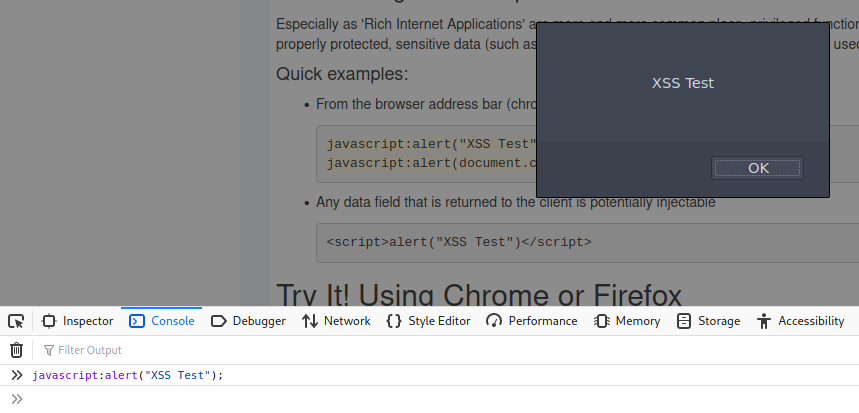
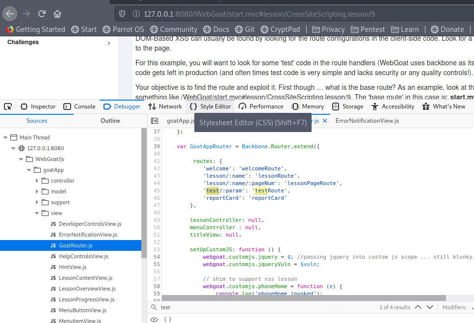
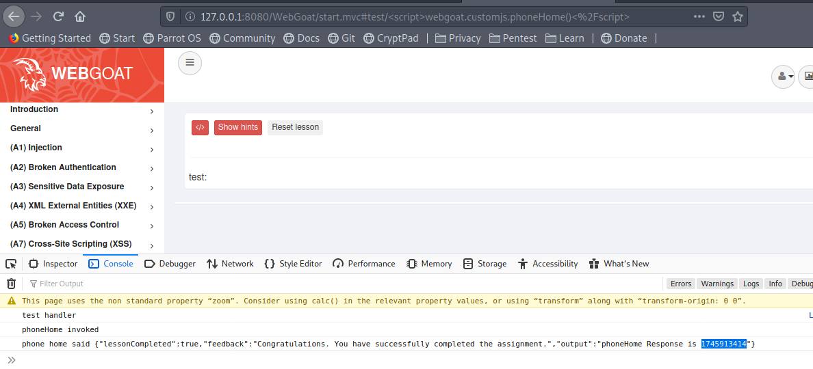

# URL para ingresar a webgoat
+ http://localhost:8080/WebGoat/

# A7 Cross Site Scripting (XSS)

La sección A7 de webgoat se describe cómo utilizar XSS para realizar tareas no eran pensadas por el desarrollador de la app.

## Ejercicio 1 (2)

En esta lexión webgoat pretende mostrarnos las bases de XSS mediante la demostración de ejecutar un script en la barra de búsqueda del navegador. Sin embargo, la mayor parte de los navegadores actuales ya no permiten esto.

Para los ejemplos propuestos hay que abrir la consola de desarrollador **(F12)** o **(Click derecho, inspeccionar elemento, consola)** para copiar y pegar los scripts.



El ejercicio espera que copies y pegues la sentencia mostrada `javascript:alert(document.cookie);` en la barra de direcciones de una nueva pestaña. Para finalmente ingreses la respuesta en el campo esperado. Sin embargo, los navegadores actuales ya no permiten esta operación.

La respuesta que webgoat espera es:
`yes`

## Ubicaciones más comunes
+ Campos de busqueda que devuelven una cadena de busqueda al usuario
+ Entradas que hacen echo de los datos del usuario
+ Mensajes de error que devuelven el texto proporcionado por el usuario
+ Campos ocultos que contienen datos proporcionados por el usuario
+ Cualquier página que muestre datos proporcionados por el usuario.
+ Pizzara de mensajes y comentarios
+ Encabezados HTTP

## Impacot
+ Robar cookies de sesión
+ Crear solicitudes falsas
+ Crear campos falsos en una página para recopilar credenciales
+ Redireccionar su página a un sitio `` no amigable ''
+ Crear solicitudes que se hacen pasar por un usuario válido
+ Robo de información confidencial.
+ Ejecución de código malicioso en un sistema de usuario final (scripting activo)
+ Inserción de contenido hostil e inapropiado

## Tipos de XSS

**Reflejado**
+ El contenido malicioso de una solicitud de usuario se muestra al usuario en un navegador web
+ El contenido malicioso se escribe en la página después de la respuesta del servidor
+ Se requiere ingeniería social
+ Se ejecuta con privilegios de navegador heredados del usuario en el navegado

**Basados en el DOM**
+ El contenido malicioso de una solicitud del usuario es utilizado por los scripts del lado del cliente para escribir HTML en su propia página
+ Similar al XSS reflejado
+ Se ejecuta con privilegios de navegador heredados del usuario en el navegador
+ La carga útil jamás toca el servidor

**Almacenado, persistente**
+ El contenido malicioso se almacena en el servidor (en una base de datos, sistema de archivos u otro objeto) y luego se muestra a los usuarios en un navegador web
+ No se requiere ingeniería social

## Ejercicio 2 (7)

En este ejercicio se nos pide verificar qué campos son susceptibles a XSS. 
+ En un ataque XSS reflejado, un atacante puede crear una URL con el script de ataque y publicarlo en otro sitio web, enviarlo por correo electrónico o hacer que una víctima haga clic en él.

Una manera fácil de averiguar si un campo es vulnerable a un ataque XSS es usar:
+ Los métodos alert () 
+ console.log (). 

#### Use uno de ellos para averiguar qué campo es vulnerable.
+ El campo vulnerable es el de la tarjeta de crédito.

En teoría esto es lo que se envía cuando se presiona input. Por lo que podría ingresarlo mediante otra etiqueta HTML y enviarlo a alguna víctima.

```
/WebGoat/CrossSiteScripting/attack5a?QTY1=1&QTY2=1&QTY3=1&QTY4=1&field1=<script>alert('my%20javascript%20here')</script>4128+3214+0002+1999&field2=111
```

## Ejercicio 3 (10)

Este ejercicio nos muestra que el XSS basado en DOM generalmente se puede encontrar buscando las configuraciones de ruta en el código del lado del cliente. Nos pide entonces
+ Buscar una ruta que tome entradas que se están "reflejando" en la página.

**Pero, ¿Qué es una ruta?**
Por ejemplo, en nuestra aplicación actual vemos `http://127.0.0.1:8080/WebGoat/start.mvc#lesson/CrossSiteScripting.lesson/9` donde:
+ La 'ruta base' en este caso es: `start.mvc#lesson/` 
+ Los parámetros son `CrossSiteScripting.lesson/9`  

**¿Por qué nos interesa encontrar la ruta?**
Porque a veces, el código de prueba se deja en producción (y muchas veces el código de prueba es muy simple y carece de seguridad o de controles de calidad).

#### Encuentre la ruta de pruebas para la aplicación actual

Entonces, con la ayuda de desarrollo integradas por el navegador vamos al código fuente e inspeccionamos hasta el llegar al documento javascript que se encarga de manejar las rutas:



Aquí encontramos un objeto llamado `routes` que almacena los valores de:
`'test/:param': 'testRoute',`

Siendo que nuestra URL completa es: `http://127.0.0.1:8080/WebGoat/start.mvc#lesson/CrossSiteScripting.lesson/9` solamente tenemos que susituir la ruta base por la nueva, quedando así de la siguiente manera:
+ La 'ruta base' en este caso es: `start.mvc#test/` 

**Respuesta:**
+ `start.mvc#test/`

## Ejercicio 4 (11)

Algunos de los ataques no son visibles, pues se ejecutan en parte en el servidor, por fortuna para este ejercicio tenemos el servidor aquí. 

#### Usando la ruta que se encontró en el ejercicio anterior tratemos de ejecutar la función:
```javascript
webgoat.customjs.phoneHome()
```

**Consideraciones importantes:**
+ Debe activarse desde una URL en una nueva pestaña
+ Una vez que se active esto devolverá como respuesta un número aleatoreo. Ese número aleatoreo es la repsuesta.
+ Debemos escapar el `</script>` pues el navegador lo interpretan como una ruta.
	+ Buscamos `https://www.w3schools.com/tags/ref_urlencode.ASP` y encontramos que `/` es `%2F`

**Hacemos esta prueba:**
`http://127.0.0.1:8080/WebGoat/start.mvc#test/<script>alert('test')<%2Fscript>` nos muestra el alert y entonces podemos proceder a correr la función que queremos.

**Entonces ingresamos a la URL:**
`http://127.0.0.1:8080/WebGoat/start.mvc#test/<script>webgoat.customjs.phoneHome()<%2Fscript>` nos muestra el alert y entonces podemos proceder a correr la función que queremos. 

Abrimos nuestra consola de desarrollo y encontramos una pantalla como la siguiente:


Copiamos nuestro número aleatoreo que nos regresa (`1745913414`) y ingresamos como respuesta.

## Ejercicio 5 (12)

Este es un test para el cuál nos recomiendan leer https://owasp.org/www-community/attacks/xss/ But ya no es la URL correcta.

**¿Son los sitios web de confianza inmunes a ataques XSS?** 
+ No because the browser trusts the website if it is acknowledged trusted, then the browser does not know that the script is malicious.
+ No porque el navegador no sabe qué scripts llegan a ser maliciosos

**¿Cuándo ocurren los ataques XSS?**
+ The data is included in dynamic content that is sent to a web user without being validated for malicious content.
+ Los datos se incluyen en contenido dinámico que se envía a un usuario web sin ser validado para contenido malicioso.

**¿Qué son los ataques XSS almacenados**
+ The script is permanently stored on the server and the victim gets the malicious script when requesting information from the server.

**What are Reflected XSS attacks?**
+ They reflect the injected script off the web server. That occurs when input sent to the web server is part of the request.

**Is JavaScript the only way to perform XSS attacks?**
+ No there are many other ways. Like HTML, Flash or any other type of code that the browser executes.